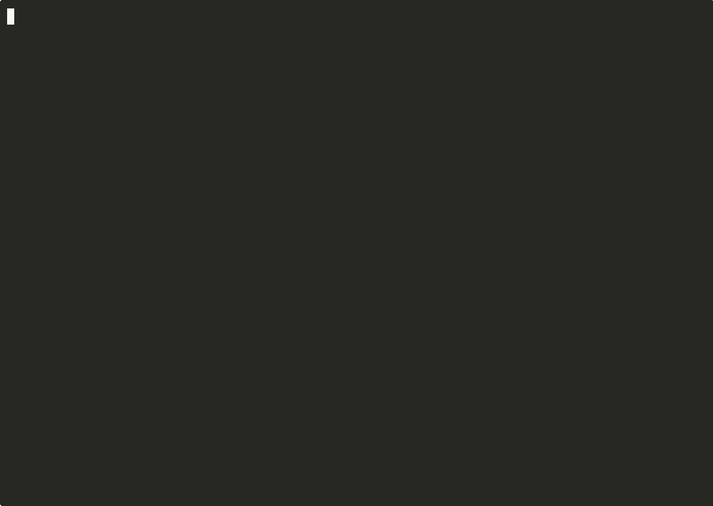
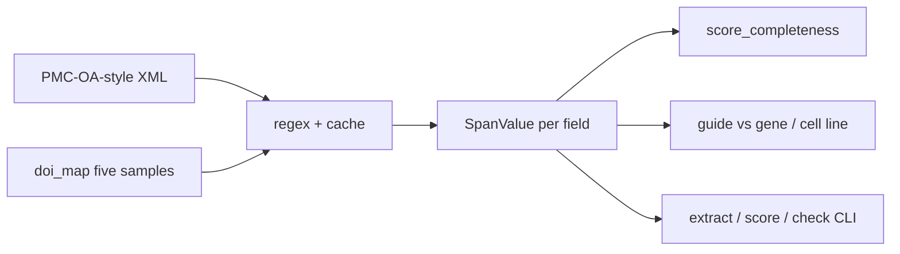

# methods-audit

A 32-field CRISPR methods schema, a span-grounded extractor that refuses
to infer, and deterministic completeness scoring plus the cross-checks
(guide vs gene, cell-line identity) that a completeness number will hide.

[](https://github.com/techiegoku2623/methods-audit/actions/workflows/ci.yml)
[](pyproject.toml)
[](LICENSE)




Regenerable terminal video: `make record`. [Full mp4](demo/out/methods-audit-demo.mp4). Per-shot loops live in `demo/out/`. See `demo/README.md`.

## Status

| Phase | Deliverable | Status |
| --- | --- | --- |
| 0 | Research memo and harnesses | Merged — docs/phase-0/research-memo.md |
| 1 | Architecture, schemas, data contracts | Merged — docs/ARCHITECTURE.md |
| 2 | First vertical slice | Merged — `extract` / `score` / `check` |
| 3 | Evaluation and demo | Merged — demo/*.cast |


## The problem this solves

CRISPR methods sections omit the guide, the genome build, or the real
name of the cell line, and then cite "as previously described." Checklists
already exist — MDAR, Nature reporting summaries, ARRIVE, MIQE. They do
not produce a span-cited extraction, and they do not catch a complete
report whose guide does not target the stated gene.

PubTator will happily invent a gene mention. This repo will not. Unfilled
fields stay missing. Completeness is a factual claim about presence in
the text, not quality. The findings that matter on the designed set are
the cross-checks.

This is research / decision-support tooling. It is not a misconduct
determination and not a recommendation to retract. Records are designed
snippets, not a live PMC OA dump. See `docs/METHODOLOGY.md`.

## Walkthrough

No credentials. `make demo` runs the full extract/score/check walkthrough
on the five committed samples. Commands below are the same steps, captured
as real stdout.

```bash
make setup && make demo
```

### Step 1 — extract with every field and span

```bash
methods-audit extract --paper data/sample/complete.xml
```

Actual stdout:

```
complete  /agent/repos/methods-audit/data/sample/complete.xml
every field (unfilled = missing; nothing is inferred):

  target_gene                   filled   TP53  source=regex  span=133-137  
quote='TP53'
  species                       filled   Homo sapiens  source=regex  
span=147-159  quote='Homo sapiens'
  genome_build                  filled   GRCh38  source=regex  span=161-167  
quote='GRCh38'
  cas_nuclease                  filled   SpCas9  source=regex  span=204-210  
quote='SpCas9'
  guide_sequence                filled   GGCGCCATCTACAAGCAGTC  source=regex  
span=257-277  quote='GGCGCCATCTACAAGCAGTC'
  pam_motif                     filled   NGG  source=regex  span=320-323  
quote='NGG'
  delivery_method               filled   Ribonucleoprotein  source=regex  
span=366-383  quote='Ribonucleoprotein'
  cell_line_or_organism         filled   HEK293T  source=regex  span=433-440  
quote='HEK293T'
  editing_assay                 filled   amplicon NGS  source=regex  
span=585-597  quote='amplicon NGS'
  n_biological_replicates       filled   3  source=regex  span=636-637  
quote='3'
  nontargeting_control          filled   non-targeting sgRNA  source=regex  
span=527-546  quote='non-targeting sgRNA'
  off_target_analysis_method    filled   CRISPOR  source=regex  span=351-358  
quote='CRISPOR'
  cell_line_rrid                filled   RRID:CVCL_0063  source=regex  
span=454-468  quote='RRID:CVCL_0063'
  donor_template_type           missing
  donor_sequence                missing
  animal_strain                 missing
  n_animals                     missing
  animal_sex                    missing
  guide_strand                  filled   Watson  source=regex  span=294-300  
quote='Watson'
  genomic_coordinates           filled   chr17:7676594-7676613  source=regex  
span=169-190  quote='chr17:7676594-7676613'
  cas_variant                   filled   eSpCas9  source=regex  span=220-227  
quote='eSpCas9'
  selection_method              filled   puromycin  source=regex  span=792-801  
quote='puromycin'
  reported_editing_efficiency   missing
  clone_isolation               filled   Single-cell clones  source=regex  
span=747-765  quote='Single-cell clones'
  off_target_sites_tested       filled   8  source=regex  span=704-705  
quote='8'
  antibody_rrid                 filled   RRID:AB_331743  source=regex  
span=908-922  quote='RRID:AB_331743'
  plasmid_rrid                  filled   Addgene 62988  source=regex  
span=877-890  quote='Addgene 62988'
  guide_design_software         filled   CRISPOR  source=regex  span=351-358  
quote='CRISPOR'
  harvest_timepoint             missing
  culture_conditions            filled   DMEM with 10% FBS at 37 °C  
source=regex  span=491-517  quote='DMEM with 10% FBS at 37 °C'
  statistical_test              filled   Student's t-test  source=regex  
span=970-986  quote="Student's t-test"
  karyotype_or_cn_check         filled   karyotyped  source=regex  
span=1000-1010  quote='karyotyped'

Research tool only. Completeness scoring is not a judgment of experimental 
quality or of whether a paper should have been published. Phase 0 records are 
designed synthetic methods snippets, not a live PMC OA dump. Unfilled fields are
missing, never inferred.
```

### Step 2 — score a missing guide

```bash
methods-audit score --paper data/sample/no-guide.xml
```

`methods-audit score --doi 10.0000/methods-audit.no-guide` resolves the
same file from the committed five-sample DOI map.

Actual stdout:

```
no-guide  /agent/repos/methods-audit/data/sample/no-guide.xml
completeness:  0.923  (12/13 applicable fields filled)
12/13 applicable fields filled. Optional fields are not in the denominator. 
Quality is not scored. Completeness is a factual claim about presence in the 
text.

missing by need (unfilled = missing; optional not in the denominator):
  required:     guide_sequence
  conditional:  (none)
  optional:     guide_strand, genomic_coordinates, cas_variant, 
selection_method, reported_editing_efficiency, clone_isolation, 
off_target_sites_tested, antibody_rrid, plasmid_rrid, karyotype_or_cn_check

applicable fields:
  target_gene                   filled   need=required
  species                       filled   need=required
  genome_build                  filled   need=required
  cas_nuclease                  filled   need=required
  guide_sequence                missing  need=required
  pam_motif                     filled   need=required
  delivery_method               filled   need=required
  cell_line_or_organism         filled   need=required
  editing_assay                 filled   need=required
  n_biological_replicates       filled   need=required
  nontargeting_control          filled   need=required
  off_target_analysis_method    filled   need=required
  cell_line_rrid                filled   need=conditional

Research tool only. Completeness scoring is not a judgment of experimental 
quality or of whether a paper should have been published. Phase 0 records are 
designed synthetic methods snippets, not a live PMC OA dump. Unfilled fields are
missing, never inferred.
```

### Step 3 — guide does not target gene

```bash
methods-audit check --paper data/sample/guide-mismatch.xml
```

Actual stdout:

```
guide-mismatch  /agent/repos/methods-audit/data/sample/guide-mismatch.xml
completeness: 1.000 (presence only; not a quality or misconduct score)

guide_targets_gene  FAIL
  detail:     Stated guide does not target stated gene TP53 (best Hamming 11 > 
2).
  target_gene span:  quote='TP53'  span=133-137
  guide_sequence span:  quote='AATTCCCGTCGCTATCAAGG'  span=216-236
  alignment:  guide=AATTCCCGTCGCTATCAAGG  window=CACAGCACATGACGGAGGTT  
strand=reverse_complement  offset=33  Hamming=11  max_allowed=2

cell_line_identity  PASS
  detail:     HeLa is not on the committed Cellosaurus-style misidentification 
list.
  cell_line_or_organism span:  quote='HeLa'  span=306-310


Research tool only. Completeness scoring is not a judgment of experimental 
quality or of whether a paper should have been published. Phase 0 records are 
designed synthetic methods snippets, not a live PMC OA dump. Unfilled fields are
missing, never inferred.
```

### Step 4 — Cellosaurus identity, then eval

```bash
methods-audit check --paper data/sample/bad-cell-line.xml
make eval
```

Actual stdout of `check`:

```
bad-cell-line  /agent/repos/methods-audit/data/sample/bad-cell-line.xml
completeness: 1.000 (presence only; not a quality or misconduct score)

guide_targets_gene  PASS
  detail:     Guide aligns to CFTR with 0 mismatch(es).
  target_gene span:  quote='CFTR'  span=133-137
  guide_sequence span:  quote='ATGGCGCTCTGGGCCTGTTC'  span=212-232
  alignment:  guide=ATGGCGCTCTGGGCCTGTTC  window=ATGGCGCTCTGGGCCTGTTC  
strand=forward  offset=2  Hamming=0  max_allowed=2

cell_line_identity  FAIL
  detail:     INT-407 is listed as misidentified (reported as embryonic 
intestinal epithelium; actually HeLa; source ICLAC / Cellosaurus CVCL_1903).
  cell_line_or_organism span:  quote='INT-407'  span=298-305
  Cellosaurus / ICLAC identity record:
    reported_as:  embryonic intestinal epithelium
    actually:     HeLa
    source:       ICLAC / Cellosaurus CVCL_1903


Research tool only. Completeness scoring is not a judgment of experimental 
quality or of whether a paper should have been published. Phase 0 records are 
designed synthetic methods snippets, not a live PMC OA dump. Unfilled fields are
missing, never inferred.
```

`make eval` regenerates `docs/EVALUATION.md`: per-field F1 vs gold, a
regex-only baseline column, and the self-agreement ceiling. Completeness
is not quality. Unfilled stays missing.

Recordings: `demo/01-extract-with-spans.cast`,
`demo/02-consistency-checks.cast`, `demo/03-per-field-eval.cast`.

## Layout

Read in this order:

1. `docs/METHODOLOGY.md` — what a number is allowed to mean
2. `docs/ARCHITECTURE.md` — schema, spans, DOI map
3. `docs/phase-0/research-memo.md` — why the schema and the failure condition
4. `data/sample/README.md` — why each demo file exists
5. `src/methods_audit/fields.py` — the 32-field schema
6. `src/methods_audit/extract.py` — regex + cache, quote or missing
7. `src/methods_audit/checks.py` — guide complementarity and cell-line identity
8. `research/phase0/` — the three measurements behind the memo
9. `src/methods_audit/cli.py` — `extract`, `score`, `check`, `demo`

## Results

Regenerated by `make eval`. Baseline column is mandatory.

<!-- EVAL_TABLE_BEGIN -->

| Measurement | Result | n | Notes |
| --- | --- | --- | --- |
| Median field F1 | 1.000 | 50 | Floor 0.70 |
| Regex-only median F1 (baseline) | 1.000 | 50 | Same gold; no cache merge |
| Self-agreement ceiling | 1.000 | 15 | Median per-field value agreement |
| Annotator value agreement | 0.981 | 15 | Upper bound on extraction accuracy |
| Cheapest USD/paper (input+assumed output) | 0.000345 | 50 | tiktoken + committed prices |
| Live PMC OA completeness leaderboard | unmeasured | — | Not pulled |

Median field F1 is 1.000 (>= 0.70). Regex-only baseline median F1 is 1.000. Self-agreement ceiling (median per-field value agreement) is 1.000. A completeness leaderboard on this extractor is defensible on the probe set.

<!-- EVAL_TABLE_END -->

## 🏗️ Architecture & Event Topology



A field is `filled` only when `quote` occurs in the source. Completeness
is filled applicable fields over applicable fields. Optional fields are
not in the denominator. Quality is not scored.

## ⚖️ Architecture Trade-offs & Pragmatic Decisions

| Chosen | Given up | What would change the answer |
| --- | --- | --- |
| Schema first (32 fields, cited) | Free-text then cluster | A live annotation study that needs a 41st field |
| Regex + committed cache | Live LLM in Phase 0 | field_f1 median F1 ≥ 0.70 on OA gold with a model |
| Completeness ≠ quality | A single "methods score" | The spec forbids it; S3 is the teaching case |
| Committed probe set instead of PMC dump | Live OA gold | DUA-free Phase 0; replace the 50 before a leaderboard |
| Unquoted fills forbidden | Soft inference | Indirect.xml must stay empty |

## 🛡️ Edge Cases & Failure Modes

- Missing guide: field stays missing; check skipped (S2).
- Guide does not target gene: field filled; check fails; both spans printed (S3).
- INT-407: completeness may be high; identity check fails with the ICLAC record (S4).
- "As previously described": nothing filled (S5).
- Cache quote not in the XML: ignored.
- HDR / in-vivo conditionals attach only to extracted triggers.
- Unknown gene symbol: guide check skipped, not guessed.
- `--doi` outside the five-sample map: fail closed.
- Live Cellosaurus synonyms: unmeasured.

## Limitations

This is not a misconduct engine. It does not replace a methods reviewer.
The extractor reads designed snippets, not PMC OA. Completeness is not
quality. Genome-wide off-target search is not implemented. See
`docs/METHODOLOGY.md`.

## License and citation

MIT. Cite the MDAR Framework (Chambers / Macleod and co-publishers, 2020),
Nature Portfolio reporting summaries, ARRIVE 2.0 (Percie du Sert et al.,
2020), MIQE (Bustin et al., 2009), Hsu, Lander, Zhang 2014 Cell, Concordet
& Haeussler 2018 NAR, Bairoch 2018 Cellosaurus, and this repository for
the extractor and the checks.
