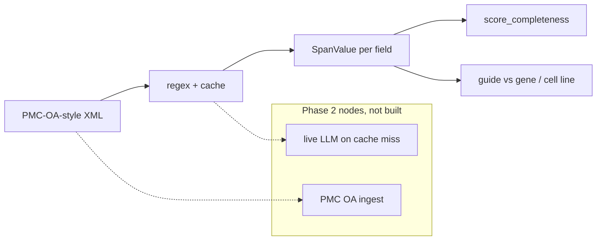

# methods-audit

A 32-field CRISPR methods schema, a span-grounded extractor that refuses
to infer, and deterministic completeness scoring plus the cross-checks
(guide vs gene, cell-line identity) that a completeness number will hide.

[](https://github.com/techiegoku2623/methods-audit/actions/workflows/ci.yml)
[](pyproject.toml)
[](LICENSE)

## Status

| Phase | Deliverable | Status |
| --- | --- | --- |
| 0 | Research memo and harnesses | In review — docs/phase-0/research-memo.md |
| 1 | Architecture, schemas, data contracts | Not started |
| 2 | First vertical slice | Not started |
| 3 | Evaluation and demo | Not started |

Status values: Not started / In progress / In review / Merged.

## The problem this solves

CRISPR methods sections omit the guide, the genome build, or the real
name of the cell line, and then cite "as previously described." Checklists
already exist — MDAR, Nature reporting summaries, ARRIVE, MIQE. They do
not produce a span-cited extraction, and they do not catch a complete
report whose guide does not target the stated gene.

PubTator will happily invent a gene mention. This repo will not. Unfilled
fields stay missing. Completeness is presence over the schema, not quality.
The findings that matter on the designed set are the cross-checks.

This is research / decision-support tooling. It is not a misconduct
determination and not a recommendation to retract. Phase 0 records are
designed snippets, not a live PMC OA dump.

## Walkthrough

Phase 0 ships the designed sample set and the measurement harnesses. The
`methods-audit extract` commands below are reserved for Phase 2; running
them now is not implemented on purpose.

### Step 1 — designed sample set

```bash
make setup && make demo
```

`make demo` calls `methods-audit demo-plan`. Actual stdout:

```
methods-audit designed sample methods sections

S1-complete  complete.xml
  path:     thoroughly reported methods section; most required fields present
  expected: Extractor fills most required fields from spans. Completeness is high. Guide matches TP53. Cell line is not on the misidentification list.

S2-no-guide  no-guide.xml
  path:     missing guide sequence — the most common omission
  expected: guide_sequence stays missing. Completeness drops. Guide-target check is skipped, not guessed.

S3-guide-mismatch  guide-mismatch.xml
  path:     stated guide does not target the stated gene
  expected: guide_sequence is filled (AATTCCCGTCGCTATCAAGG). Complementarity check FAILs against TP53. Completeness still counts the field as present.

S4-bad-cell-line  bad-cell-line.xml
  path:     cell line on the committed Cellosaurus-style misidentification list
  expected: cell_line_or_organism = INT-407. cell_line_identity FAILs. Completeness may still be high.

S5-indirect  indirect.xml
  path:     information present only as 'as previously described' — extraction must fail
  expected: Required fields stay missing. Cache quotes are empty. Completeness is low. No hallucinated gene, guide, or cell line.
```

The records are designed: complete, no guide, guide mismatch, misidentified
line, and indirect. See `data/sample/README.md`.

Recordings `demo/01-extract.cast` land in Phase 3.

### Step 2 — complete report (Phase 2)

```bash
methods-audit extract --xml data/sample/complete.xml --explain
```

Reserved. Sample S1. The spans are the product, not the completeness number.

### Step 3 — missing guide (Phase 2)

```bash
methods-audit extract --xml data/sample/no-guide.xml --explain
```

Reserved. Sample S2. Inventing a protospacer is a bug.

### Step 4 — inconsistency (Phase 2)

```bash
methods-audit extract --xml data/sample/guide-mismatch.xml --explain
methods-audit extract --xml data/sample/bad-cell-line.xml --explain
```

Reserved. Completeness can be high. The checks must fail.

### Step 5 — refusal, then the measured baseline

```bash
methods-audit extract --xml data/sample/indirect.xml
make eval
```

`methods-audit extract` on S5 is reserved (missing, not a guess).
`make eval` already runs: it regenerates `docs/EVALUATION.md` from the Phase
0 harnesses. The median field F1 in Results is that output.

## Layout

Read in this order:

1. `docs/phase-0/research-memo.md` — why the schema and the failure condition
2. `data/sample/README.md` — why each demo file exists
3. `src/methods_audit/fields.py` — the 32-field schema
4. `src/methods_audit/extract.py` — regex + cache, quote or missing
5. `src/methods_audit/checks.py` — guide complementarity and cell-line identity
6. `research/phase0/` — the three measurements behind the memo
7. `src/methods_audit/cli.py` — demo-plan only, until Phase 2

## Results

Regenerated by `make eval`. Baseline column is mandatory.

<!-- EVAL_TABLE_BEGIN -->

| Measurement | Result | n | Notes |
| --- | --- | --- | --- |
| Median field F1 | 1.000 | 50 | Floor 0.70 |
| Annotator value agreement | 0.981 | 15 | Upper bound on extraction accuracy |
| Cheapest USD/paper (input+assumed output) | 0.000345 | 50 | tiktoken + committed prices |
| Live PMC OA completeness leaderboard | Phase 3 | — | Not pulled |

Median field F1 is 1.000 (>= 0.70). A completeness leaderboard on this extractor is defensible on the probe set.

<!-- EVAL_TABLE_END -->

## 🏗️ Architecture & Event Topology



A field is `filled` only when `quote` occurs in the source. Completeness
is filled applicable fields over applicable fields. Optional fields are
not in the denominator. Quality is not scored.

## ⚖️ Architecture Trade-offs & Pragmatic Decisions

| Chosen | Given up | What would change the answer |
| --- | --- | --- |
| Schema first (32 fields, cited) | Free-text then cluster | A live annotation study that needs a 41st field |
| Regex + committed cache | Live LLM in Phase 0 | field_f1 median F1 ≥ 0.70 on OA gold with a model |
| Completeness ≠ quality | A single "methods score" | The spec forbids it; S3 is the teaching case |
| Committed probe set instead of PMC dump | Live OA gold | DUA-free Phase 0; replace the 50 before a leaderboard |
| Unquoted fills forbidden | Soft inference | Indirect.xml must stay empty |

## 🛡️ Edge Cases & Failure Modes

- Missing guide: field stays missing; check skipped (S2).
- Guide does not target gene: field filled; check fails (S3).
- INT-407: completeness may be high; identity check fails (S4).
- "As previously described": nothing filled (S5).
- Cache quote not in the XML: ignored.
- HDR / in-vivo conditionals attach only to extracted triggers.
- Unknown gene symbol: guide check skipped, not guessed.
- Live Cellosaurus synonyms: unmeasured.

## Limitations

This is not a misconduct engine. It does not replace a methods reviewer.
Phase 0 extracts designed snippets, not PMC OA. Completeness is not
quality. No demo recording is committed. Genome-wide off-target search is
not implemented.

## License and citation

MIT. Cite the MDAR Framework (Chambers / Macleod and co-publishers, 2020),
Nature Portfolio reporting summaries, ARRIVE 2.0 (Percie du Sert et al.,
2020), MIQE (Bustin et al., 2009), Hsu, Lander, Zhang 2014 Cell, Concordet
& Haeussler 2018 NAR, Bairoch 2018 Cellosaurus, and this repository for
the extractor and the checks.
